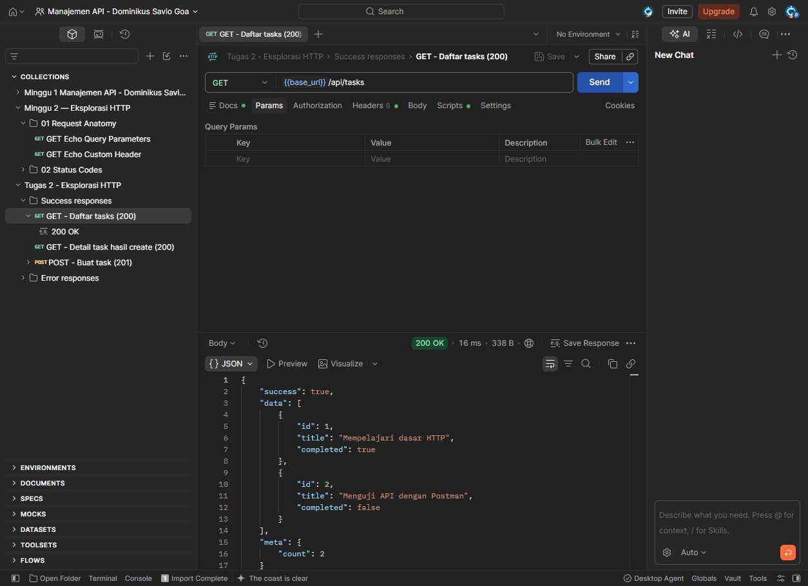
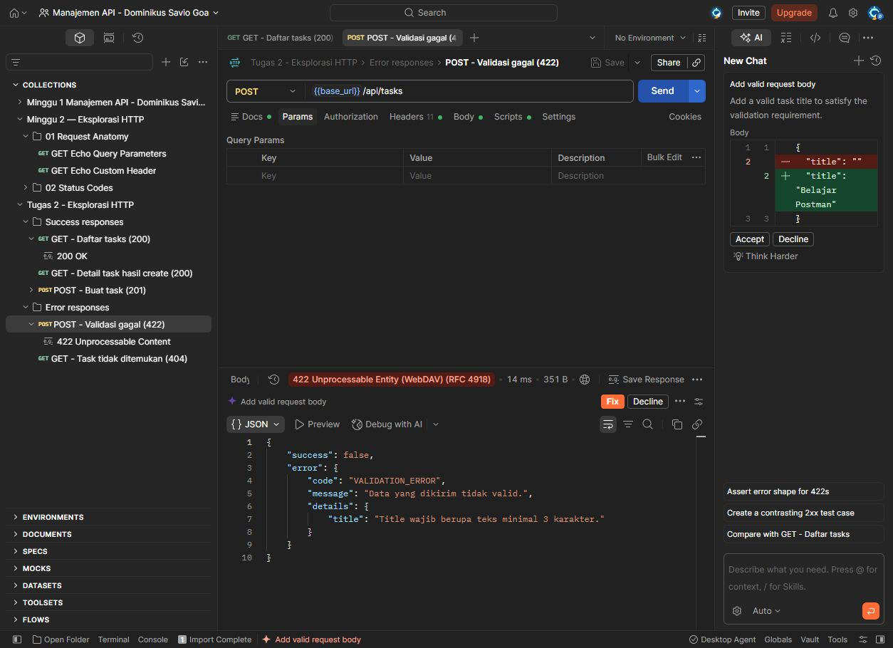

# Minggu 2 — Dokumentasi Eksplorasi HTTP

## 1. Tujuan

Menerapkan HTTP, REST, JSON, status code, dan Postman pada API sederhana.

## 2. Perubahan

- Membuat REST API untuk data `tasks`.
- Menambahkan endpoint `GET` dan `POST`.
- Membuat response sukses dan error dalam format JSON.
- Menambahkan validasi data.
- Menambahkan automated test dan Postman collection.

Saya memakai `/api/tasks` karena endpoint ini mewakili resource task. `GET`
dipakai untuk mengambil data dan `POST` untuk membuat data baru.

## 3. Endpoint atau API contract

Base URL: `http://127.0.0.1:3000`

| Method | Endpoint | Hasil |
| --- | --- | --- |
| `GET` | `/api/tasks` | Daftar task, status `200` |
| `GET` | `/api/tasks/{id}` | Detail task atau error `404` |
| `POST` | `/api/tasks` | Task baru `201` atau error validasi `422` |

Field yang dipakai:

- `id`: dibuat oleh server;
- `title`: wajib, minimal 3 karakter;
- `completed`: boolean, nilai awal `false`.

Response sukses memakai `success: true`. Response error memakai
`success: false`, `code`, dan `message`.

## 4. Bukti pengujian

Test dijalankan dengan:

```bash
node --test
```

Hasilnya:

```text
tests 5
pass 5
fail 0
```

Pengujian manual dilakukan di Postman memakai collection
`postman/Tugas-2-HTTP.postman_collection.json`.

### Success response

Request:

```http
GET /api/tasks
```

Status: `200 OK`

```json
{
  "success": true,
  "data": [
    {
      "id": 1,
      "title": "Mempelajari dasar HTTP",
      "completed": true
    }
  ],
  "meta": {
    "count": 2
  }
}
```



## 5. Error case

Saya mengirim `title` kosong ke `POST /api/tasks`.

```json
{
  "title": ""
}
```

Status: `422 Unprocessable Content`

```json
{
  "success": false,
  "error": {
    "code": "VALIDATION_ERROR",
    "message": "Data yang dikirim tidak valid.",
    "details": {
      "title": "Title wajib berupa teks minimal 3 karakter."
    }
  }
}
```

Status `422` dipakai karena format JSON benar, tetapi datanya tidak sesuai
aturan.



## 6. Kesimpulan

API sudah memakai method, JSON, dan status code sesuai contract. Response
sukses dan error juga sudah diuji melalui automated test dan Postman.

## 7. Referensi

### Referensi kelas

- [Materi 1 — API dalam Sistem Modern](https://app.notion.com/p/Materi-1-API-dalam-Sistem-Modern-26c8bda175f98119acdef67232f637d0)
- [Praktikum 1 — Audit API dengan Postman](https://app.notion.com/p/Praktikum-1-Audit-API-dengan-Postman-26c8bda175f981a9a0e0c121c9355b32)
- [Tugas 1 — Audit API dan Ide Proyek Semester](https://app.notion.com/p/Tugas-1-Audit-API-dan-Ide-Proyek-Semester-3d78bda175f98117b123c21f376e893c)
- [Materi 2 — HTTP, REST, JSON, dan Status Code](https://app.notion.com/p/Materi-2-HTTP-REST-JSON-dan-Status-Code-26c8bda175f9806cba15c1f99e022acd)
- [Praktikum 2 — Eksplorasi HTTP dengan Postman](https://app.notion.com/p/Praktikum-2-Eksplorasi-HTTP-dengan-Postman-26c8bda175f980b7873ffe5830138835)
- [Tugas 2 — Dokumentasi Eksplorasi HTTP](https://app.notion.com/p/Tugas-2-Dokumentasi-Eksplorasi-HTTP-2738bda175f98090a791d1161e9769f0)

### Referensi tambahan

- [Node.js HTTP](https://nodejs.org/api/http.html)
- [MDN HTTP status code](https://developer.mozilla.org/en-US/docs/Web/HTTP/Reference/Status)
- [Postman test scripts](https://learning.postman.com/docs/tests-and-scripts/write-scripts/test-scripts/)

## 8. Deklarasi penggunaan AI

Saya menggunakan AI untuk membantu menyusun kode, mengecek API contract, dan
membuat skenario pengujian. Hasilnya saya cek lagi dengan materi kelas dan
referensi lain. Endpoint, test, dan Postman collection saya jalankan sendiri.
Tidak ada credential atau secret yang dimasukkan ke repository.
